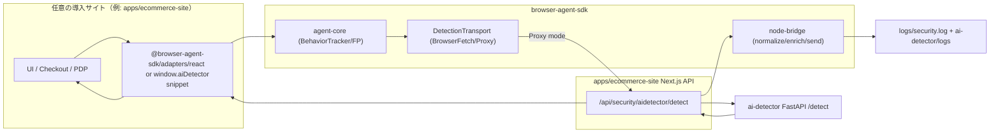
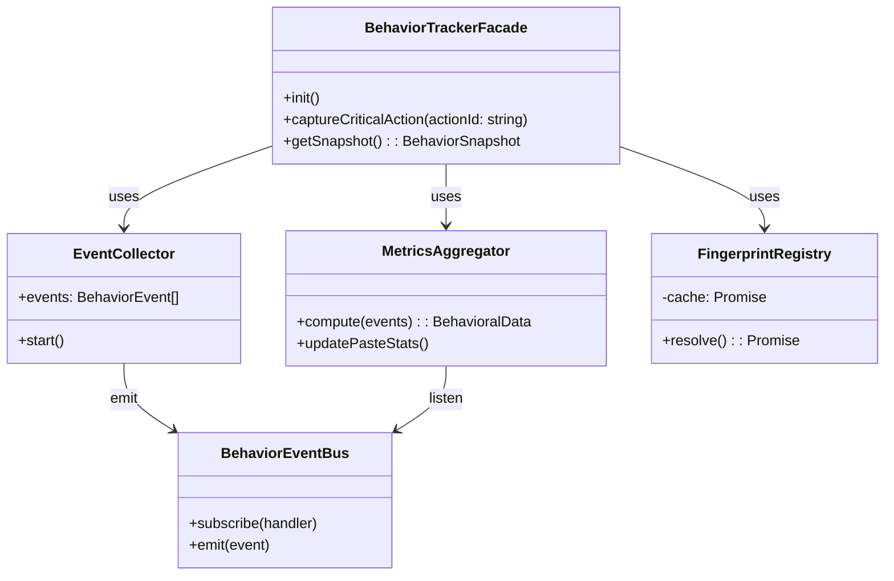
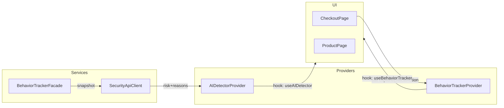

# ECサイト向けブラウザ操作拡張 & AI Detector連携 実装方針

## 1. 背景と目的

- `docs/browser-detection-v2.md` で推奨されている **多層シグナルの統合（TLS/HTTP指紋＋行動時系列＋補助指紋）** を、`apps/ecommerce-site` のブラウザ計測に取り込みたい。
- 収集した拡張データを `ai-detector`（FastAPI + LightGBM + KMeans/IsolationForest）へ送信し、**AIエージェント検知スコアを本番想定のLightGBM推論に置き換える**。
- API側のモデル改修はスコープ外。ただし `UnifiedDetectionRequest` へ準拠したペイロードを組み立て、LightGBMや将来のJa4/HTTP署名特徴量に再利用できるフォーマットで渡す。

## 2. 現状整理

| レイヤ | 実装 | 課題 |
| --- | --- | --- |
| クライアント計測 | `lib/behavior-tracker.ts` がマウス/クリック/キー/スクロール/フォーム情報と `deviceFingerprint` を計算し、5秒おきに `/api/security/aidetector/detect` へ送信。 | ブラウザ情報の粒度は高いが、**canvas/webGL/JA4/HTTP署名等の多層シグナル活用が未整理**。`BehaviorTracker`が直接APIへPOSTしているため、サーバー側で `ai-detector` へ中継する余地がない。 |
| Next.js API | `/api/security/aidetector/detect` は `computeBotScore` で疑似スコアを返し、`/check` もモック値。 | **`ai-detector` 実サービスと未連携**。`aiDetector.endpointUrl/apiKey` も未使用。クライアント通知は `window` イベントで代替予定。 |
| ai-detector | `POST /detect` が `UnifiedDetectionRequest` を受け取り、`services/feature_extractor.py` が 26 特徴量を計算し LightGBM へ入力。 | クライアントから送られてくるデータが仕様 (`docs/browser-detection-data.md`, `docs/data-model.md`) に合致しないと精度が担保できない。 |

## 3. 要求されるシグナル整理（`docs/browser-detection-v2.md` 抜粋）

1. **強シグナルの組み合わせ**  
   - TLS/JA4, HTTP Message Signatures, 行動時系列（IAT、スクロールゆらぎ、フォーム入力速度）。
2. **ブラウザフィンガープリント強化**  
   - Canvas/WebGL指紋、`navigator.userAgentData`、Chromium派生判定、`vendor/appVersion/platform` 等。
3. **行動時系列の可視化**  
   - クリック/スクロール/キー操作間隔、初回操作遅延、Paste率、休憩頻度。
4. **誤検知対策**  
   - スコアの多段判定（allow/challenge/block）と、疑義セッションの重点サンプリング。

本戦略では TLS/HTTP 署名収集はサーバー／NW 層の課題として後続タスクに残し、クライアントで取得できるシグナルの密度を上げた上で API へ正規化して渡す。

## 4. 実装方針（リポジトリ再編後）

### 4.1 ルートディレクトリ構成の再定義

`apps/ecommerce-site` を「SDK 利用側のリファレンス実装」、`ai-detector` を「推論 API」、そして **新規ディレクトリ `browser-agent-sdk/`** を「ブラウザ操作とフィンガープリントを収集し API へ転送するエージェント」として切り分ける。

| ディレクトリ | 役割 | 主な成果物 |
| --- | --- | --- |
| `browser-agent-sdk/` | 第3者サイトが流用できるブラウザ計測エージェント。 | `packages/agent-core`（イベント収集/指紋/行動統計）、`packages/adapters/*`（React/Vanilla/Node ブリッジ）、`packages/web-snippet`（GA4 風 IIFE）。 |
| `apps/ecommerce-site/` | SDK 利用例および Next.js API のホスト。最小コードでエージェントを呼び出す。 | `app/providers`（SDK adapter の薄いラッパー）、`app/api/security/aidetector/*`（SDK の Node ブリッジを呼び出すだけ）。 |
| `ai-detector/` | FastAPI + LightGBM の推論サービス。 | 既存 `UnifiedDetectionRequest` スキーマとモデル群。 |

こうすることで、ブラウザ計測や API リクエストの実装を `browser-agent-sdk/` に集約し、他プロジェクトでも `` のような GA4 風スニペットとして第三者に配布可能。`window.aiDetector` グローバルを生やし、`aiDetector('init', { endpoint, apiKey })` 等のコマンドキュー方式を採用すれば、アプリ内部に React がなくても利用できる。
- **初期化フロー**: GA4 と同様にコマンドキュー (`window.aiDetectorQueue = window.aiDetectorQueue || []`) を定義し、スニペット読み込み前にエンドユーザーが `aiDetector('config', {...})` を呼んでも問題ないようにする。SDK 本体読み込み後にキューを flush し `BehaviorTrackerFacade` を初期化。
- **ホストアプリとの連携**: React/Next.js 以外でも `aiDetector('capture', { action: 'CHECKOUT_SUBMIT' })` を呼べるよう、Facade API を **文字列コマンド + 引数** にマッピングするアダプタ層 `CommandRouter` を追加（I/F Segregation）。既存 Provider はこのコマンド API を呼ぶだけで統合可能。
- **配布形態**: `browser-agent-sdk` のワークスペースを npm へ公開し、`packages/web-snippet` で `esm`/`iife` を生成。`apps/ecommerce-site` は npm パッケージとしてこの SDK を依存し、自前ビルドでは tree-shaking。第三者は `<script>` で IIFE を取り込むか、`import { createBehaviorTracker } from '@browser-agent/sdk'` するかを選択できる。
- **設定伝搬**: セキュリティ上の理由から `endpointUrl`/`apiKey` を直に露出させないため、スニペット版は **署名付き一時トークン**（例: `data-ai-detector-token` 属性）を受け取り、Next.js 側で API Key を管理するプロキシ (`/api/security/aidetector/detect`) を必須にする。これにより第三者利用時も秘密情報がブラウザに残らない。
- **依存注入**: UMD バンドルでは `fetch`/`crypto` などブラウザネイティブ API のみを使い、アプリ固有の logger や storage を `aiDetector('provide', 'logger', customLogger)` のように登録できるようにする（Dependency Inversion を保ったままサードパーティが拡張可能）。
- **ドキュメント化**: README には GA4 ライクな導入例を掲載し、`<script>` コード片と `npm install @browser-agent/sdk` の両方を案内。将来的にプラットフォーム横断で利用できるよう `data-layer` 連携（例: `window.dataLayer.push({ event: 'aidetector-risk', score })`）も検討する。

これらの詳細設計により、React における副作用乱用やグローバルシングルトン乱立といったアンチパターンを避けつつ、SOLID を満たしたクラス/イベント構造で `apps/ecommerce-site` へ安全に実装を展開できる。

---

この方針に沿って実装することで、`docs/browser-detection-v2.md` が求める「多層シグナル × 行動時系列 × API連携」の骨格を Next.js 側で整え、`ai-detector` の LightGBM モデルをそのまま活用できるパイプラインへ移行できる。
